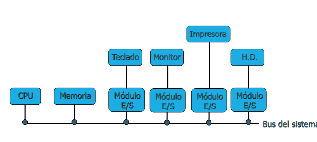
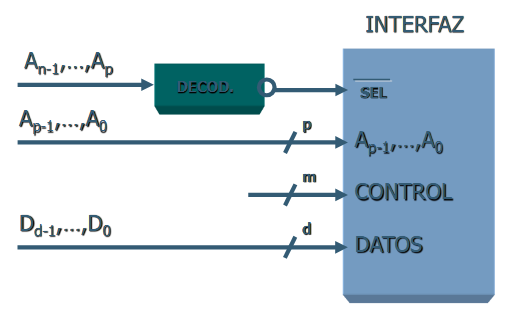
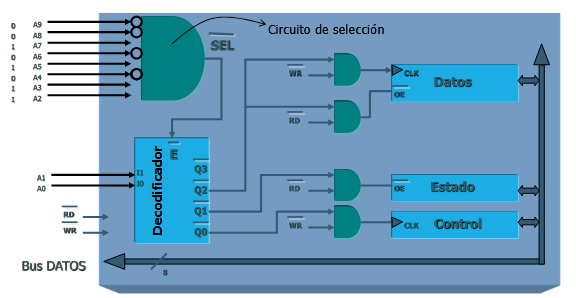
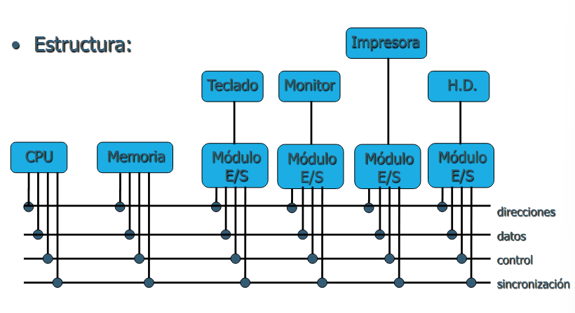
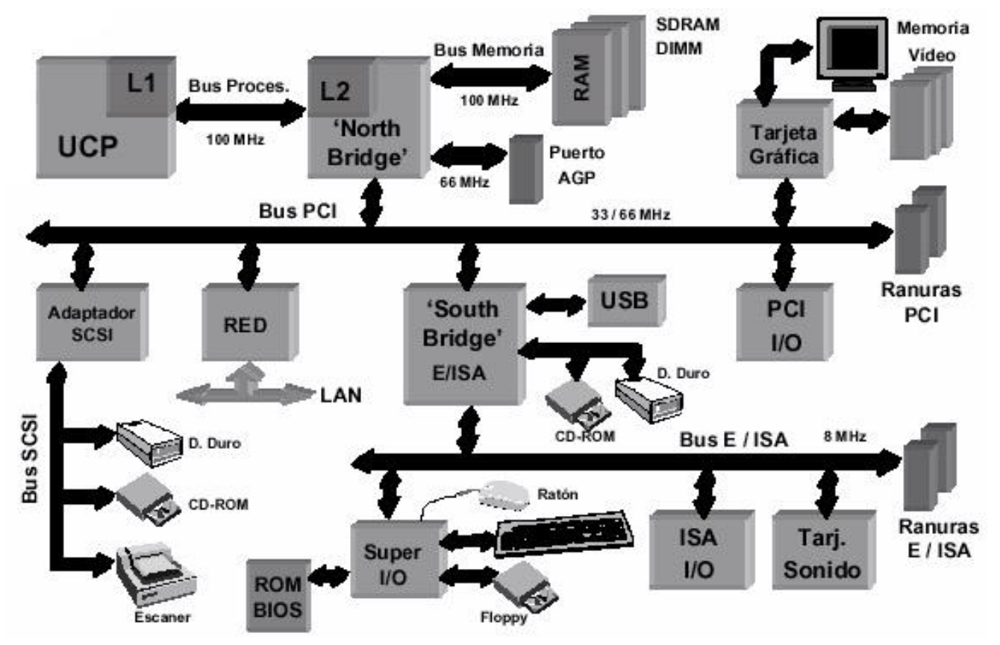
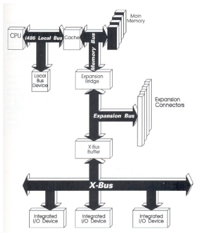
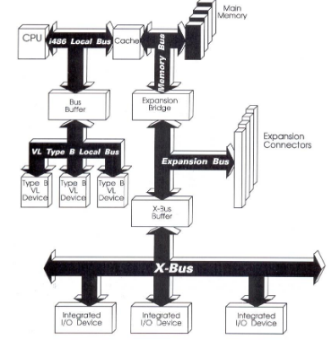
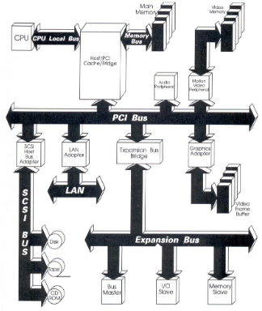

# Periféricos e Interfaces

## Tema 1

### 1. Estructura Básica de un Computador

Un ordenador se compone principalmente, de la CPU, la memoria y de los dispositivos de entrada y salida. Entre ellos hay una serie de interconexiones para poder comunicarse. Los perifericos son dispositivos que están fuera del computador, y se conectan a través del controlador de E/S.

La CPU, a su vez, contiene los registros, controladores, ALUs, etc., todos ellos conectados entre sí

### 1.2. Funcionamiento Básico de un Computador

Lo podemos englobar todo en la siguiente image, donde los diferentes recurso han de pasar por un mecanismo de control:

### 1.3. Planteamiento General E/S

El esquema de E/S es el siguiente:

Un sistema de E/S presenta las siguientes funciones:

- Direccionamiento: se encarga de seleccionar al dispositivo.
- Sincronización: inicio de la transferencia.
- Transferencia: según el método de la tranferencia.

Diagrama simplificado de la interfaz de E/S:

Hay un Bus del Sistema que conecta los diferentes Módulos de E/S con la CPU y la memoria:

Los módulos de E/S tienen diferentes funciones, como por ejemplo:

- Adaptación del periférico.
- Adaptación de la velocidad.
- Almacenamiento temporal.
- Adaptación de formatos.

Ejemplos de estos módulos podrían ser: controlador de teclado, controlador gráfico, controlador HD/FD, tarjeta de red, controladora SCSI...

#### Técnicas de E/S

Tenemos 3 tipos de técnicas, que las podemos clasificar en la siguiente tabla:

||Sin Interrupciones|Usando Interrupciones|
| -------- | -------- | -------- |
|**Transferencia E/S a Memoria a través de la CPU**|E/S programada|E/S mediante interrupciones|
|**Transferencia directa de E/S a memoria**||Acceso directo a memoria (DMA)|

##### E/S Programada

La comunicación se realiza entre el módulo de E/S y la CPU, la cual siempre es iniciada por la CPU. Tiene que ir consultando (query) para conocer el estado del módulo de E/S.

- Inconvenientes: la CPU tiene que dedicarse a los procesos de E/S.
- Ventajas: velocidad alta en las operaciones de E/S.

El proceso de ejecución de una instrucción de E/S implica:

- Activación de la dirección del módulo de E/S en el bus de direcciones.
- Activación de las líneas de control que especifican la orden de E/S.

Hay varios tipos de líneas de control: control, test, lectura y escritura.

También hay diferentes tipos de direccionamiento:

1. **E/S asignada en memoria** (Memory Mapped I/O):

    - La CPU ve los registros de un dispositivo de E/S como posiciones de memoria.
    - Se utilizan las mismas instrucciones para E/S que para acceso a memoria.
    - Como ventaja tenemos que es muy sencillo.
    - Como desventaja, la pérdida de espacio en memoria.

2. **E/S aislada**: aquí las direcciones de E/S y memoria se diferencias mediante una señal de control.

###### Selección de un Dispositivo de E/S

###### Decodificación en una Interfaz de E/S

##### E/S mediante Interrupciones

En este caso, un fispositivo externo puede llamar la atención de la CPU. El proceso es el siguiente:

1. El módulo de E/S provoca la interrupción.
2. La CPU le comunca un orden de E/S y vuelve al proceso interrumpido.
3. Cuando la subrutina de E/S se ha ejecutado, el módulo de E/S le comunica a la CPU su fin mediante una interrupción, para que ésta ejecute una porción de código para decidir el estado del dispositivo y decidir la próxima acción.

- Ventaja: atención inmediata (útil para teclados, o adaptadores de red). Además, el procesador puede realizar trabajo útil mientras el dispositivo de E/S está ocupado.

La gestión de interrución se realiza mediante líneas de interrupción dedicadas (Controlador de interrupciones), cada dispositivo tiene asignada una de estas líneas.

O también, mediante líneas de interrupciones compartidas: donde cada línea de interrupción puede ser empleada por más de un módulo de E/S. Para lograr esto, se necesita un mecanismo de identificación del módulo de E/S que provocó la interrupción, ya sea por hardware o por software.

##### Acceso Directo a Memoria (DMA)

Permite la transferencia directa de datos entre el módulo de E/S y la memoria, liberando completamente a la CPU. Debe existir un módulo adicional en el bus que sea capaz de tomar el control del mismo y acceder directamente a la memoria como si fuese la CPU: módulo DMA. En este tipo de técnica de E/S, existe una competencia por el bus (bus contention).

## Tema 2

### 2.1. Concepto de Bus Normalizado

Un BUS es un conjunto de líneas eléctricas (tiras de metal sobre una placa de circuito impreso). Y es un medio compartido:

#### Líneas Típicas del BUS de Control

- Escritura en memoria.
- Lectura en memoria.
- Escritura de E/S.
Lectura de E/S.
- Transferencia reconocida.
- Petición del bus.
- Petición de interrupción.
- Interrupción reconocida.
- Reloj.
- Inicio (Reset).

#### Procesos de Transferencia

##### Escritura de E/S

1. El módulo de E/S que quiera iniciar la transferencia solicita el uso del bus (`Bus Request`).
2. El arbitrador le concede el bus (`Bus Grant`).
3. Sitúa en el bus de direcciones l dirección de memoria o puerto de E/S donde se quiere transferir el dato.
4. Sitúa el dato a transferir en el bus de datos.
5. Activa la línea `I/O Write` del bus de control.
6. El destinatario ha recibido el dato (`Tranfer ACK`).
7. Deja libre el bus para ser usado por otro módulo.

##### Lectura E/S

1. El módulo de E/S que quiere iniciar la trasnferencia solicita el uso del bus (`Bus Request`).
2. El arbitrador le concede el bus (`Bus Grant`).
3. Sitúa en el bus de direcciones l dirección de memoria o puerto de E/S donde se quiere transferir el dato.
4. Sitúa el dato a transferir en el bus de datos.
5. Activa la línea `I/O Read` del bus de control.
6. El destinatario ha recibido el dato (`Tranfer ACK`).
7. Lectura del dato en el bus de datos.
8. Deja libre el bus para ser usado por otro módulo.

#### Notación Importante

- El bus que inicia la transferencia es el **Bus Master**.
- El módulo que es direccionado por el Bus Master se denomina **Bus Slave**.
- **Arbitrador**: es el circuito especial que recoge las peticiones para tomar el control del bus y decide quién debe tomarlo en cada momento.

#### Arquitectura de un PC Actual

### 2.2. BUS AT, ISA, EISA

### 2.3. BUS PCI, AGP

`Nota`: aparte del siguiente punto, no entra nada más de este apartado en el examen.

#### Métododes de Conexión de un Dispositivo al BUS Local del Microprocesador

1. **Conexión directa**
    Presenta una serie de restricciones:
    - Dependencia del procesador.
    - Sólo puede ser utilizado un dispositivo local para evitar problemas de impedancia por extra carga.
    - La interfaz de conexión del dispositivo con el bus local costosa, dada la alta frecuencia a la que se trabaja.
    - No permite transferencias de datos entre la CPU y otros dispositivos mientras el dispositivo conectado directamente al bus local mantenga transferencas con otros periféricos.

    

2. **Conexión mediante buffer**
    - Mejoras respecto a la conexión directa: Al estar el bus local con buffer eléctricamente aislado del bus local del procesador, sólo presenta una impedancia. Usualmente se pueden ubicar hasta tres dispositivos.
    - Restricciones: En esencia, el bus local con buffer y el bus local del procesador son un único bus: cualquier transferencia iniciada por la CPU alcanzará el bus local con buffer, aunque no se dirija a ninguno de los dispositivos alojados allí. Es decir, no es posible la utilización simultánea.

    

3. **Conexión con filosofía de estación de trabajo**.

    - En cuanto a sus mejoras, tenemos la introducción de una caché de nivel 2 unida a un puente para adaptar las velocidades de transferencia entre el bus local del procesador y el bus de entrada/salida de alta velocidad. Además tenemos la independencia del procesador que implementa la CPU.

    

#### 2.4. Plug and Play

#### 2.5. Ejemplos de Aplicación

## Tema 3
