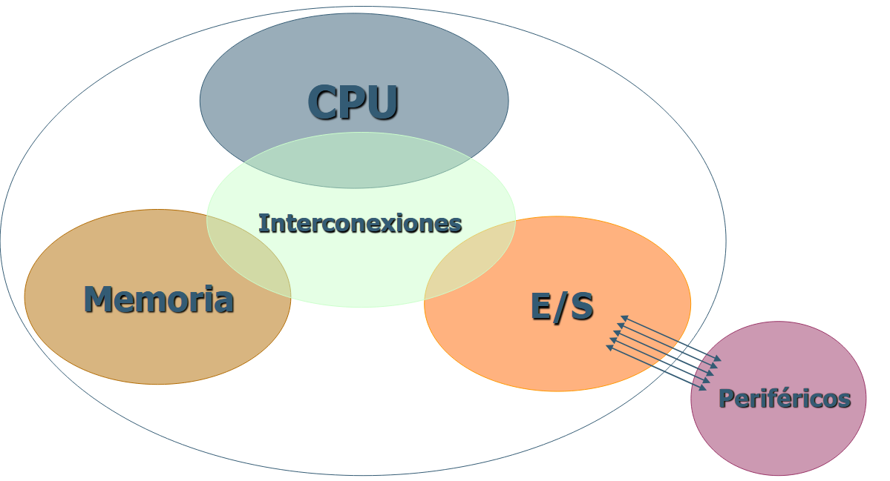
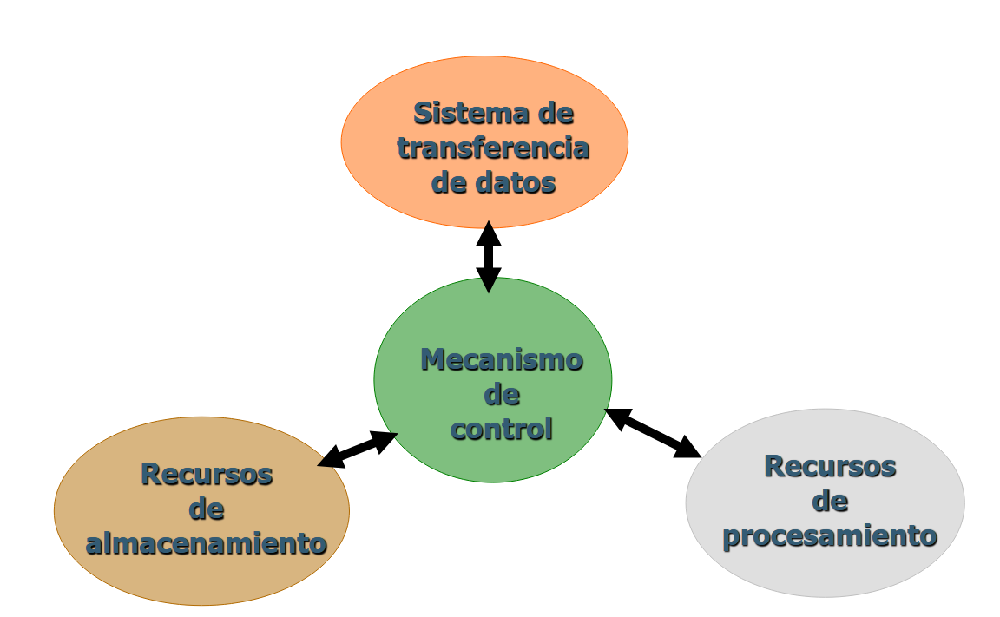
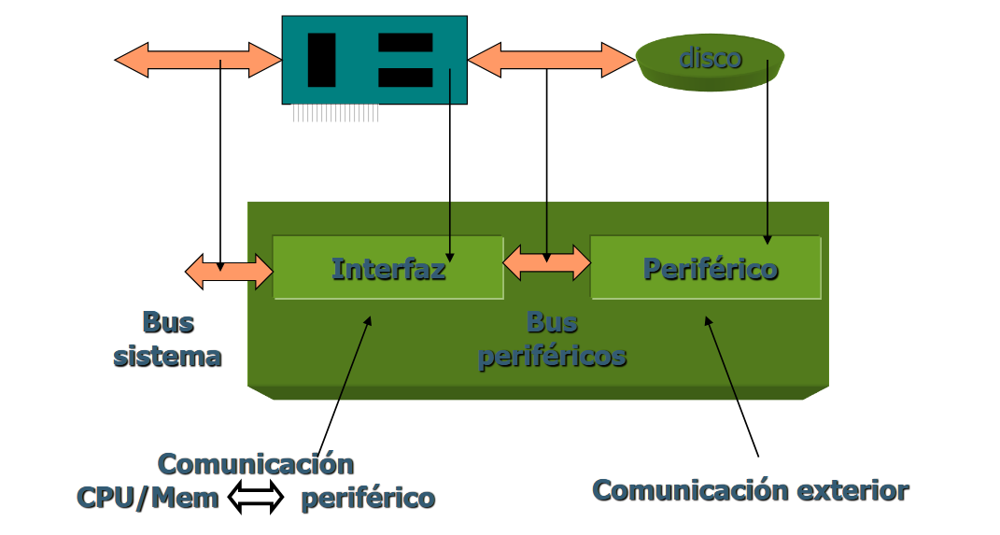
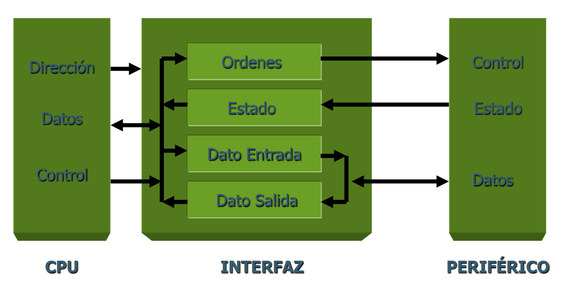

# Periféricos e Interfaces

## Tema 1

### 1. Estructura Básica de un Computador

Un ordenador se compone principalmente, de la CPU, la memoria y de los dispositivos de entrada y salida. Entre ellos hay una serie de interconexiones para poder comunicarse. Los perifericos son dispositivos que están fuera del computador, y se conectan a través del controlador de E/S.

La CPU, a su vez, contiene los registros, controladores, ALUs, etc., todos ellos conectados entre sí

### 1.2. Funcionamiento Básico de un Computador

Lo podemos englobar todo en la siguiente image, donde los diferentes recurso han de pasar por un mecanismo de control:

### 1.3. Planteamiento General E/S

El esquema de E/S es el siguiente:

Un sistema de E/S presenta las siguientes funciones:

- Direccionamiento: se encarga de seleccionar al dispositivo.
- Sincronización: inicio de la transferencia.
- Transferencia: según el método de la tranferencia.

Diagrama simplificado de la interfaz de E/S:

Hay un Bus del Sistema que conecta los diferentes Módulos de E/S con la CPU y la memoria:

// Mainframe; ver diferencia con el pc

Los módulos de E/S tienen diferentes funciones, como por ejemplo:

- Adaptación del periférico.
- Adaptación de la velocidad.
- Almacenamiento temporal.
- Adaptación de formatos.

Ejemplos de estos módulos podrían ser: controlador de teclado, controlador gráfico, controlador HD/FD, tarjeta de red, controladora SCSI...

#### Técnicas de E/S

Tenemos 3 tipos de técnicas, que las podemos clasificar en la siguiente tabla:

||Sin Interrupciones|Usando Interrupciones|
| -------- | -------- | -------- |
|**Transferencia E/S a Memoria a través de la CPU**|E/S programada|E/S mediante interrupciones|
|**Transferencia directa de E/S a memoria**||Acceso directo a memoria (DMA)|

##### E/S Programada

La comunicación se realiza entre el módulo de E/S y la CPU, la cual siempre es iniciada por la CPU. Tiene que ir consultando (query) para conocer el estado del módulo de E/S.

- Inconvenientes: la CPU tiene que dedicarse a los procesos de E/S.
- Ventajas: velocidad alta en las operaciones de E/S.

// Rellenar

##### E/S mediante Interrupciones

En este caso, un fispositivo externo puede llamar la atención de la CPU. El proceso es el siguiente:

1. El módulo de E/S provoca la interrupción.
2. La CPU le comunca un orden de E/S y vuelve al proceso interrumpido.
3. Cuando la subrutina de E/S se ha ejecutado, el módulo de E/S le comunica a la CPU su fin mediante una interrupción, para que ésta ejecute una porción de código para decidir el estado del dispositivo y decidir la próxima acción.

- Ventaja: atención inmediata (útil para teclados, o adaptadores de red). Además, el procesador puede realizar trabajo útil mientras el dispositivo de E/S está ocupado.

La gestión de interrución se realiza mediante líneas de interrupción dedicadas (Controlador de interrupciones), cada dispositivo tiene asignada una de estas líneas.

O también, mediante líneas de interrupciones compartidas: donde cada línea de interrupción puede ser empleada por más de un módulo de E/S. Para lograr esto, se necesita un mecanismo de identificación del módulo de E/S que provocó la interrupción, ya sea por hardware o por software.

##### Acceso Directo a Memoria (DMA)

Permite la transferencia directa de datos entre el módulo de E/S y la memoria, liberando completamente a la CPU. Debe existir un módulo adicional en el bus que sea capaz de tomar el control del mismo y acceder directamente a la memoria como si fuese la CPU: módulo DMA. En este tipo de técnica de E/S, existe una competencia por el bus (bus contention).
